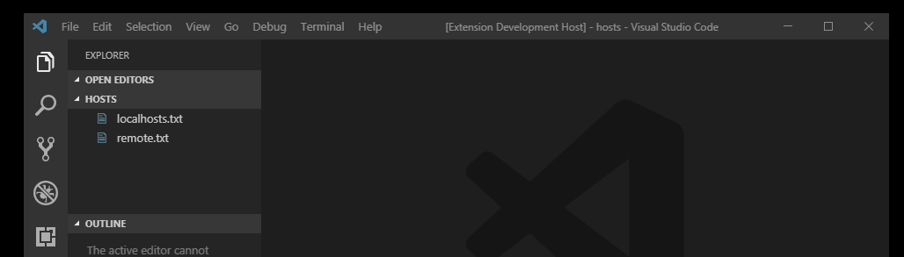
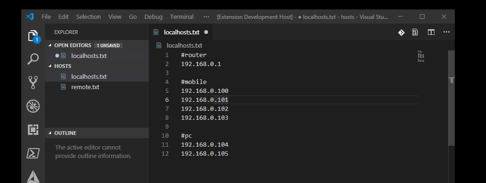
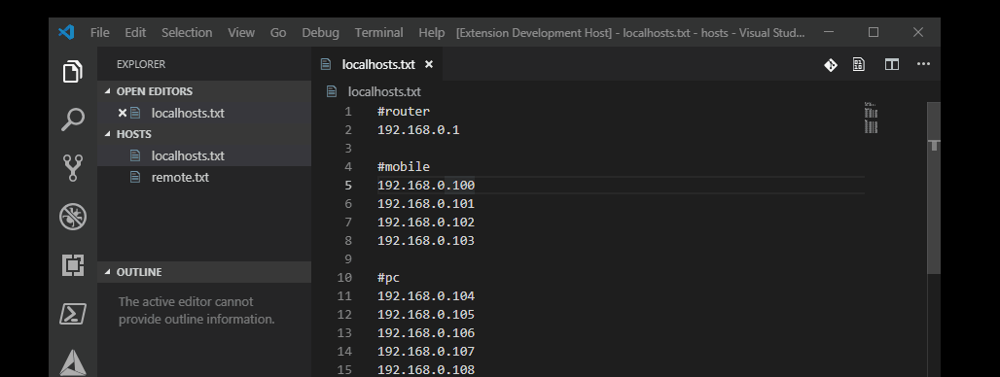
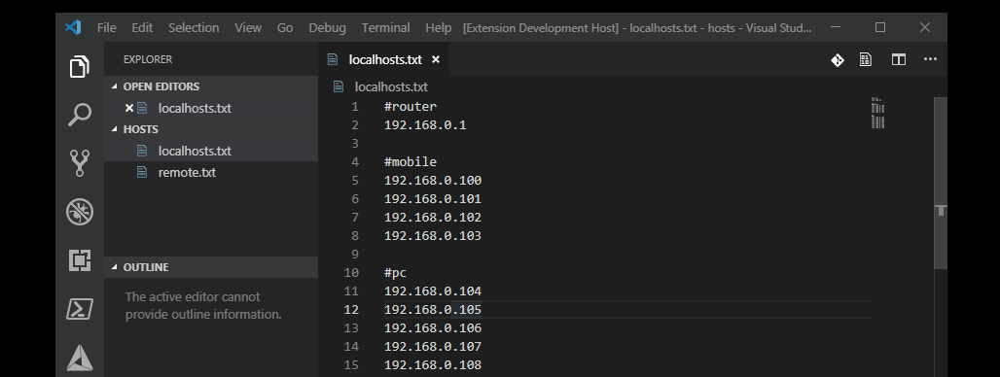
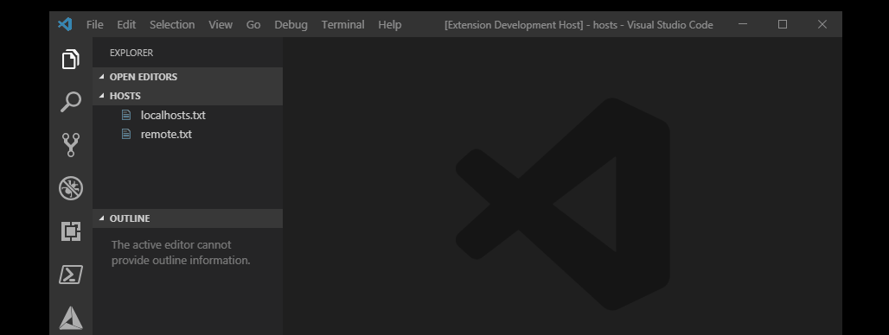

# Ping My File

This extensions adds the abbility to ping all hosts listed in a file. You can decide if you want to ping all hosts just once or ping them contionously untill stopped. Unresponsive hosts will be highlighted in a file and additionally they will be presented in "Problems".

## Features

* supports continous mode - ping will be repeated on a file 
untill you stop it

* unresponsive hosts are reported in problems so you can easily navigate to them

* you can edit file while ping is in continous mode - scan will be paused for specified amount of time (2 sec by default)

* once continous ping is started you can close it's file - scan will go on and you will be notified of unresponsive hosts in "problems"

## Commands

This extension contributes the following commands:

* `Ping My File: Ping this file once` - pings all hosts in a file. Results are reported:
  * in a file - by changing background color (default green/red)
  * in 'problems' section

* `Ping My File: Start ping on this file` - starts continous ping. After ping is done on all hosts in a file it waits specified amount of time then repeats the scan. Scan is also performed on closed filed. Scan is paused for specified amount of time after document is edited.

* `Ping My File: Stop ping on this file` - stops continous ping

## Extension Settings

This extension contributes the following settings:

* `pingmyfile.pausebetweenpings` - specifies how long in miliseconds we should wait with ping restart after whole file is competed.
* `pingmyfile.delayafteredit` - specifies how long in miliseconds we should wait with ping restart after file was edited.

## Release Notes

### 0.0.1

Initial release of extension
